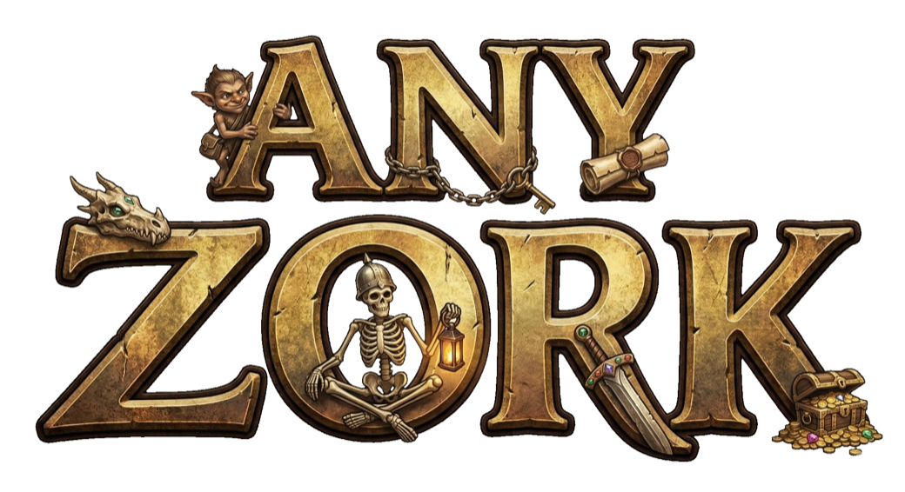

<div align="center">
  
  <h1>AnyZork</h1>
  <p><strong>A Zork-style text adventure generator. Describe a world to any LLM, get back a complete game, and play it on a fully deterministic engine — no AI needed at runtime.</strong></p>
  <p>
    <a href="#quickstart"><strong>Quickstart</strong></a>
    ·
    <a href="#docs"><strong>Docs</strong></a>
    ·
    <a href="#contributing"><strong>Contributing</strong></a>
  </p>
</div>

---

## Quickstart

> Requires Python 3.11+

```bash
git clone https://github.com/oobagi/anyzork.git
cd anyzork && python3.11 -m venv .venv && source .venv/bin/activate
pip install -e .
```

Browse and play a community game:

```bash
anyzork browse                        # see what's available
anyzork install haunted-lighthouse    # add it to your library
anyzork play haunted-lighthouse       # start playing
```

Make your own:

```bash
anyzork generate "haunted lighthouse on a cliff" -o prompt.txt
# paste prompt.txt into any LLM, save the response as lighthouse.zorkscript
anyzork import lighthouse.zorkscript -o lighthouse.zork
anyzork play lighthouse.zork
```

## Features

**[Make Your Own Game](docs/guides/CLI.md)** — Generate a prompt, paste it into any LLM to get [ZorkScript](docs/dsl/ZORKSCRIPT.md), then compile and play. A guided wizard or a one-liner gets you started.

**[Playing Games](docs/guides/CLI.md)** — Play local files or library games, manage named save slots, and list your collection.

**[Narrator Mode](docs/guides/NARRATOR.md)** — An optional live-LLM layer that rewrites room descriptions and event text without touching game state. Supports Claude, OpenAI, and Gemini.

**[Sharing Games](docs/server/SHARING.md)** — Publish games to the official catalog, browse community submissions, and install with a single command.

## Docs

| Doc | What it covers |
|---|---|
| [Game Design Document](docs/engine/GDD.md) | Mechanics, design constraints, and motivation |
| [System Architecture](docs/engine/SYSTEM-DESIGN.md) | Components, commands, and runtime model |
| [World Schema](docs/engine/WORLD-SCHEMA.md) | `.zork` database reference |
| [ZorkScript Spec](docs/dsl/ZORKSCRIPT.md) | Authoring language reference |
| [Command DSL Spec](docs/dsl/COMMANDS.md) | Runtime rule vocabulary |
| [Author Tooling](docs/design/AUTHOR-TOOLING.md) | Lint, import diagnostics, and `--report` design |
| [CLI Reference](docs/guides/CLI.md) | All commands, flags, and options |
| [Configuration](docs/guides/CONFIGURATION.md) | Config file, env vars, and provider setup |
| [Narrator Mode](docs/guides/NARRATOR.md) | Optional LLM prose layer |
| [Sharing Games](docs/server/SHARING.md) | Publishing, browsing, and installing |
| [ADR-001: SQLite Storage](docs/adrs/ADR-001-SQLITE-GAME-STORAGE.md) | Why `.zork` files are SQLite |
| [Roadmap](ROADMAP.md) | Ordered plan and milestone tracking |

## How It Works

```
 You describe a world        Any LLM writes           AnyZork compiles it       You play it
 ───────────────────   ──>   ZorkScript code   ──>    into a .zork file    ──>  deterministically
 "haunted lighthouse         (rooms, items,           (SQLite database)         No AI at runtime.
  on a cliff"                 NPCs, puzzles)                                    Pure engine.
```

1. **Generate** — `anyzork generate` builds a structured prompt from your idea (freeform or wizard-guided).
2. **Author** — You paste that prompt into any LLM. It returns [ZorkScript](docs/dsl/ZORKSCRIPT.md) — a human-readable DSL for rooms, items, NPCs, puzzles, dialogue trees, and commands.
3. **Compile** — `anyzork import` compiles ZorkScript into a `.zork` file (a SQLite database). Lint and validation catch errors before you play.
4. **Play** — The deterministic engine evaluates commands, preconditions, and effects with no LLM involved. Game state is always consistent and reproducible.

The optional [Narrator Mode](docs/guides/NARRATOR.md) adds an LLM prose layer on top — it rewrites descriptions for atmosphere but never touches game state.

## Contributing

MIT-licensed, solo-maintained. Issues and PRs welcome — small focused changes and clear bug reports are easiest to review.

## Development

```bash
pip install -e ".[dev]"
ruff check .
pytest -q
```

## License

MIT
